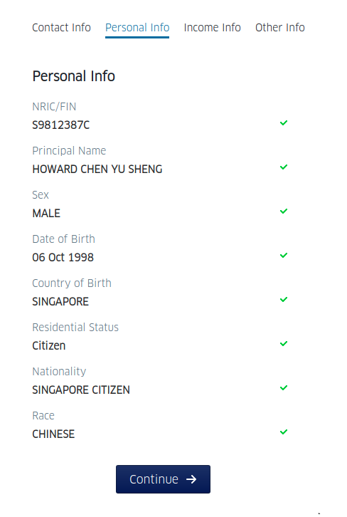

===========================================

## Overview

Use the existing code provided (or roll your own as you see fit), build a **Django-backed** application with
**React frontend** to demonstrate the integration with MyInfo APIs, similar to the Demo app provided by
Singapore Government Technology Agency (GovTech): https://github.com/ndi-trusted-data/myinfo-demo-app


## Evaluation Criteria

We will look at your project and assess it for:

1. Extensibility - separation of concerns.
2. Simplicity - aim for the simplest solution that gets the job done whilst remaining
readable, extensible and testable.
3. Test Coverage - breaking changes should break your tests.
4. Robustness - should handle and report errors.
If you have any questions about these criteria please ask.

## Specifications

1. Include a README with (accurate) usage instructions.


## Submission

Github is the preferred option (a public repo is fine) but we will also accept a .zip file if
necessary. Email your solution to gordon@ablr.com.


## MyInfo Python API Usage

Set up virtualenv

```shell script
python3 -m venv env
source env/bin/activate
pip install -r requirements.txt
```

In python shell

```python
from myinfo.client import MyInfoClient
from myinfo.security import get_decoded_access_token, get_decrypted_person_data

client = MyInfoClient()
client.get_authorise_url(state="blahblah")
# Open up this SingPass Authorise URL and follow instructions
# After clicking on the green "I Agree" button, you'll be redirected back to
# http://localhost:3001/callback?code=25e3a9679bfc9baca7ef47bceadea43fcd6eb199&state=blahblah
# Then grab the code for the next API call

# Getting access token with code
code = "25e3a9679bfc9baca7ef47bceadea43fcd6eb199"
resp = client.get_access_token(code)
access_token = resp["access_token"]

# Decoding access token
decoded_access_token = get_decoded_access_token(access_token)
uinfin = decoded_access_token["sub"]

# Getting person data
resp = client.get_person(uinfin=uinfin, access_token=access_token)
decrypted = get_decrypted_person_data(resp)
print(decrypted)
```

### Sample work

* Contact Info


* Personal Info



* Income Info


